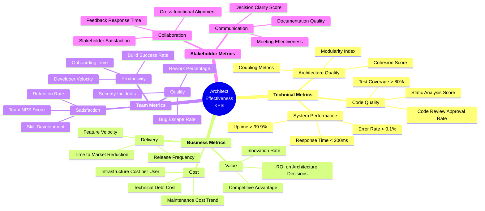
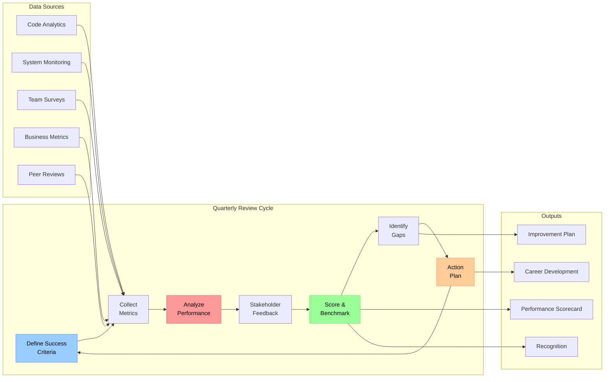
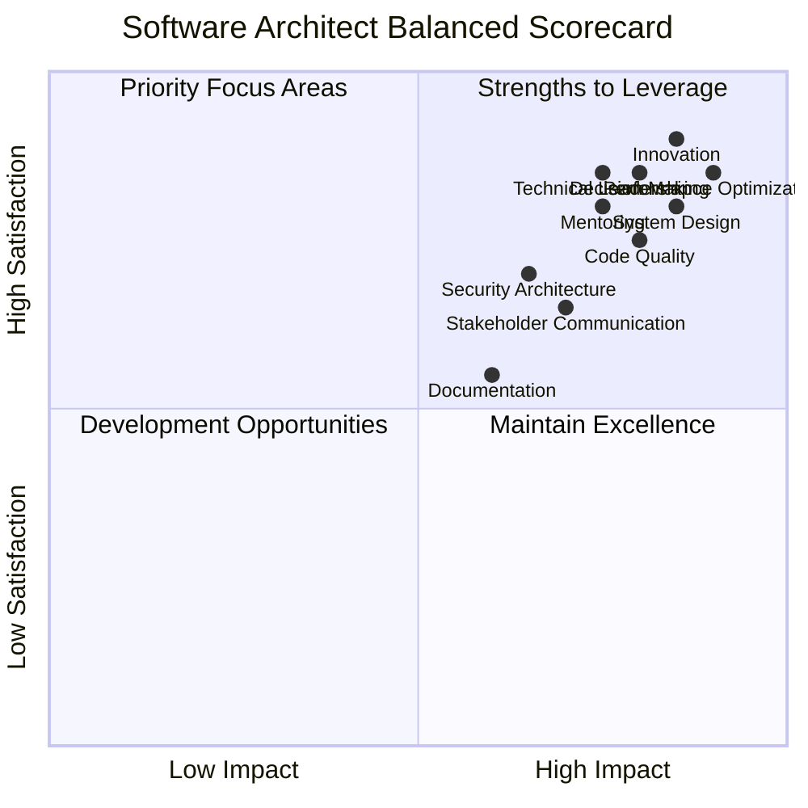
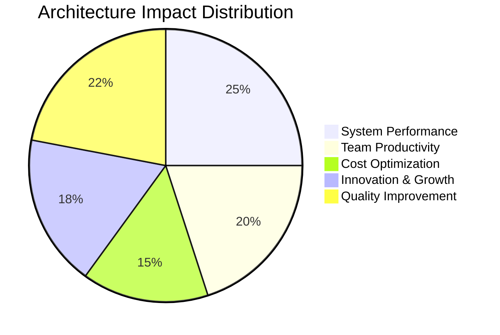
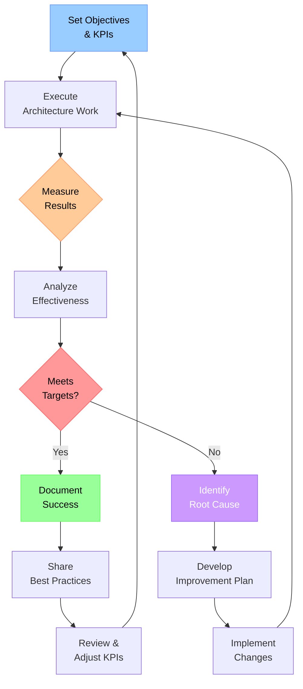

# Measuring Software Architect Effectiveness

## Capability & Role Effectiveness Framework

```mermaid
graph TB
    subgraph "Measurement Framework"
        ARCH[Software Architect Effectiveness]
    end
    
    ARCH --> CAP[Capability Metrics]
    ARCH --> ROLE[Role Performance]
    ARCH --> IMPACT[Business Impact]
    
    CAP --> CAP1[Technical Excellence]
    CAP --> CAP2[Design Quality]
    CAP --> CAP3[Leadership Impact]
    
    CAP1 --> M1[Code Quality Scores]
    CAP1 --> M2[System Reliability %]
    CAP1 --> M3[Performance Benchmarks]
    CAP1 --> M4[Security Audit Results]
    
    CAP2 --> M5[Architecture Review Scores]
    CAP2 --> M6[Design Pattern Adoption]
    CAP2 --> M7[Technical Debt Ratio]
    CAP2 --> M8[Scalability Metrics]
    
    CAP3 --> M9[Team Velocity]
    CAP3 --> M10[Knowledge Transfer Rate]
    CAP3 --> M11[Mentorship Feedback]
    CAP3 --> M12[Decision Speed]
    
    ROLE --> ROLE1[Strategic Effectiveness]
    ROLE --> ROLE2[Operational Excellence]
    ROLE --> ROLE3[Collaboration Success]
    
    ROLE1 --> M13[Innovation Index]
    ROLE1 --> M14[Tech Stack Modernization]
    ROLE1 --> M15[ROI on Architecture]
    
    ROLE2 --> M16[Incident Reduction %]
    ROLE2 --> M17[Deployment Success Rate]
    ROLE2 --> M18[Maintenance Cost Reduction]
    
    ROLE3 --> M19[Stakeholder Satisfaction]
    ROLE3 --> M20[Cross-team Collaboration Score]
    ROLE3 --> M21[Communication Effectiveness]
    
    IMPACT --> OUTCOME1[Time to Market]
    IMPACT --> OUTCOME2[Cost Efficiency]
    IMPACT --> OUTCOME3[Quality Improvement]
    IMPACT --> OUTCOME4[Team Satisfaction]
    
    style ARCH fill:#2374ab,stroke:#1a5a8a,color:#fff,stroke-width:4px
    style CAP fill:#4a90e2,stroke:#357abd,color:#fff,stroke-width:2px
    style ROLE fill:#50c878,stroke:#3da35d,color:#fff,stroke-width:2px
    style IMPACT fill:#ff9933,stroke:#cc7a29,color:#fff,stroke-width:2px
    style CAP1 fill:#7eb3d5,stroke:#5a8fb5,color:#000
    style CAP2 fill:#7eb3d5,stroke:#5a8fb5,color:#000
    style CAP3 fill:#7eb3d5,stroke:#5a8fb5,color:#000
    style ROLE1 fill:#7ed5a8,stroke:#5eb588,color:#000
    style ROLE2 fill:#7ed5a8,stroke:#5eb588,color:#000
    style ROLE3 fill:#7ed5a8,stroke:#5eb588,color:#000
```

---

## Measurement Dashboard: Key Performance Indicators

---

## Effectiveness Measurement Process

---

## Capability Maturity Matrix

```mermaid
graph TD
    subgraph "Maturity Levels"
        L1[Level 1: Basic]
        L2[Level 2: Developing]
        L3[Level 3: Proficient]
        L4[Level 4: Advanced]
        L5[Level 5: Expert]
    end
    
    subgraph "System Design"
        SD1[Can design simple systems]
        SD2[Designs with patterns]
        SD3[Scalable architectures]
        SD4[Distributed systems expert]
        SD5[Industry thought leader]
    end
    
    subgraph "Technical Leadership"
        TL1[Guides small team]
        TL2[Leads project teams]
        TL3[Influences department]
        TL4[Shapes org strategy]
        TL5[Industry influencer]
    end
    
    subgraph "Decision Making"
        DM1[Makes local decisions]
        DM2[Project-level decisions]
        DM3[Strategic tech choices]
        DM4[Enterprise-wide impact]
        DM5[Market-leading decisions]
    end
    
    L1 --> SD1
    L2 --> SD2
    L3 --> SD3
    L4 --> SD4
    L5 --> SD5
    
    L1 --> TL1
    L2 --> TL2
    L3 --> TL3
    L4 --> TL4
    L5 --> TL5
    
    L1 --> DM1
    L2 --> DM2
    L3 --> DM3
    L4 --> DM4
    L5 --> DM5
    
    style L1 fill:#ffcccc,stroke:#ff9999,color:#000
    style L2 fill:#ffe6cc,stroke:#ffcc99,color:#000
    style L3 fill:#ffffcc,stroke:#ffff99,color:#000
    style L4 fill:#ccffcc,stroke:#99ff99,color:#000
    style L5 fill:#ccffff,stroke:#99ffff,color:#000
```

---

## Balanced Scorecard: 360° View

---

## Role Effectiveness Scorecard

| Role | Key Metrics | Target | Measurement Method | Frequency |
|------|-------------|--------|-------------------|-----------|
| **Technical Visionary** | Innovation initiatives launched | 4/year | Project tracking | Quarterly |
| | Technology adoption rate | >75% | Usage analytics | Monthly |
| | Future-readiness score | >80% | Tech stack audit | Semi-annual |
| **Business-Tech Bridge** | Stakeholder satisfaction | >4.5/5 | Surveys | Quarterly |
| | Requirements alignment | >90% | Retrospectives | Sprint-end |
| | Communication clarity | >85% | Feedback forms | Monthly |
| **Decision Maker** | Decision impact score | >4/5 | Outcome review | Per decision |
| | Time to decision | <5 days | Tracking | Continuous |
| | Decision success rate | >80% | Post-implementation | Quarterly |
| **Quality Guardian** | Code quality improvement | +15%/year | Static analysis | Monthly |
| | Technical debt reduction | -10%/quarter | Debt tracking | Quarterly |
| | Security vulnerability reduction | -20%/year | Security scans | Continuous |
| **Mentor & Coach** | Team skill improvement | +20%/year | Skill assessments | Quarterly |
| | Mentee satisfaction | >4.5/5 | Feedback | After sessions |
| | Knowledge sharing sessions | 2/month | Calendar | Monthly |

---

## Success Metrics Dashboard

---

## Continuous Improvement Loop

