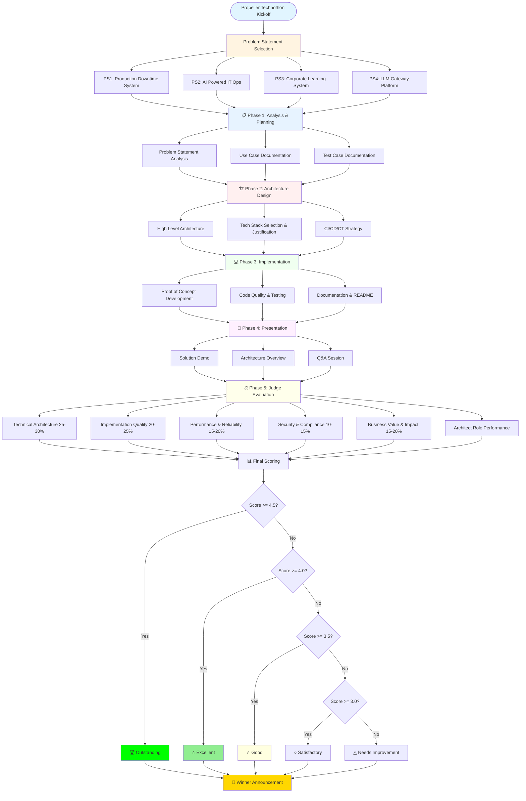
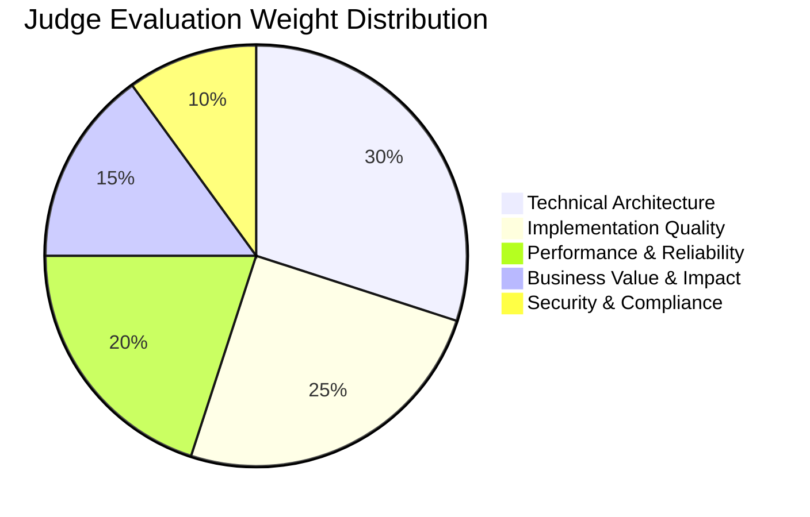

# Propeller Technothon - Software Architect Challenge Statements

## 📋 Overview

Welcome to the Propeller Technothon! This repository contains comprehensive challenge statements designed to evaluate and showcase software architect capabilities across multiple domains including production systems, AI operations, corporate learning, and AI infrastructure.

---

## 🎯 Purpose

This technothon challenges architects to demonstrate their skills in:
- System design and architecture
- Technology selection and evaluation
- Performance optimization and scalability
- Security and compliance
- Integration and interoperability
- Cost optimization
- Technical leadership and communication

---
## 🔄 Propeller Technothon Process Flow



### Process Summary

| Phase | Duration | Key Activities | Deliverables |
|-------|----------|----------------|--------------|
| **1. Analysis & Planning** | Week 1-2 | Problem analysis, use cases, test planning | Analysis doc, Use cases, Test cases |
| **2. Architecture Design** | Week 2-3 | Tech stack selection, architecture design, CI/CD planning | HLD, Tech justification, Strategy docs |
| **3. Implementation** | Week 3-8 | POC development, testing, documentation | Working POC, Code repo, README |
| **4. Presentation** | Week 9 | Demo preparation, presentation creation | Presentation slides, Demo script |
| **5. Evaluation** | Week 9-10 | Judge scoring across 6 categories | Evaluation sheets, Final scores |

### Evaluation Categories Breakdown



---
## 👨‍💼 Software Architect Capabilities and Roles

### Key Capabilities
Software architects must demonstrate expertise in:
- System design and architectural pattern knowledge
- Technology evaluation and selection
- Code review and quality assurance
- Performance optimization and scalability planning
- Security architecture and risk assessment
- Cloud and infrastructure design
- API and integration design
- Data modeling and database architecture
- Technical leadership and mentoring
- Communication with stakeholders and teams
- Documentation and diagramming
- Problem-solving and critical thinking

### Roles Played by Software Architects
1. **Technical Visionary & Strategist** - Long-term technology roadmap and innovation
2. **System Designer** - Architecture patterns, modularity, and component design
3. **Technology Decision Maker** - Stack selection, build vs buy decisions
4. **Quality Guardian** - Code quality, testing, and standards enforcement
5. **Performance & Scalability Architect** - System optimization and capacity planning
6. **Security Architect** - Security controls, compliance, and risk management
7. **Integration Architect** - API design, system interoperability
8. **Technical Leader & Mentor** - Team guidance, knowledge transfer
9. **Stakeholder Communicator** - Clear communication with business and technical teams
10. **Risk Manager** - Risk identification, mitigation, and contingency planning

📄 **Detailed Documentation**: [Software_Architect_Capabilities_Roles_V_1.0.txt](Software_Architect_Capabilities_Roles_V_1.0.txt)

📊 **Effectiveness Measurement**: [Architect_Effectiveness_Measurement.md](Architect_Effectiveness_Measurement.md)

---

## 📚 Problem Statements

### Problem Statement 1: Production Downtime Impact & Root-Cause Traceability System

**Domain**: DevOps / Site Reliability Engineering

**Objective**: Build a comprehensive system to monitor, track, analyze, and prevent production outages through real-time visibility, automated root cause analysis, and impact assessment.

**Key Features**:
- Real-time monitoring and alerting
- Automated root cause analysis engine
- Business impact quantification
- Incident management workflow
- Historical data analysis and learning

**Scope**:
- Ingestion of logs, metrics, and traces
- Alert correlation and deduplication
- Dependency mapping and impact analysis
- Automated and manual RCA tools
- Compliance reporting and dashboards

**Files**:
- 📄 Problem Statement: [Production Down Time Impact & Root- Cause Traceability System - Problem-Statement-1.txt](Problem_Statement_1_Production_Downtime/Production%20Down%20Time%20Impact%20&%20Root-%20Cause%20Traceability%20System%20-%20Problem-Statement-1.txt)
- 📘 Implementation Guide: [Production_Downtime_System_Implementation_Guide.md](Problem_Statement_1_Production_Downtime/Production_Downtime_System_Implementation_Guide.md)
- 📋 Architecture Review: [Architecture_Review_Process_Post_Implementation.md](Problem_Statement_1_Production_Downtime/Architecture_Review_Process_Post_Implementation.md)
- 📊 Judge Evaluation: [Architecture_Judge_Evaluation_Sheet.csv](Problem_Statement_1_Production_Downtime/Architecture_Judge_Evaluation_Sheet.csv)

---

### Problem Statement 2: AI Powered IT Operations (AIOps)

**Domain**: AI/ML Operations / Intelligent Automation

**Objective**: Leverage artificial intelligence and machine learning to transform traditional IT operations into an intelligent, predictive, and automated system.

**Key Features**:
- Anomaly detection using unsupervised learning
- Predictive failure analysis
- Intelligent event correlation and root cause analysis
- Automated remediation and self-healing
- Natural language processing for logs and tickets
- Performance forecasting and capacity planning
- Chatbot-based operations assistant

**Scope**:
- Multi-source data ingestion (metrics, logs, events, tickets)
- ML models for anomaly detection and prediction
- Automated remediation framework
- NLP-based log analysis
- Conversational AI for operations

**Files**:
- 📄 Problem Statement: [AI Powered IT Ops - Problem-Statement-2.txt](Problem_Statement_2_AI_Ops/AI%20Powered%20IT%20Ops%20-%20Problem-Statement-2.txt)
- 📘 Implementation Guide: [AI_Powered_IT_Ops_Implementation_Guide.md](Problem_Statement_2_AI_Ops/AI_Powered_IT_Ops_Implementation_Guide.md)
- 📋 Architecture Review: [AI_Ops_Architecture_Review_Process.md](Problem_Statement_2_AI_Ops/AI_Ops_Architecture_Review_Process.md)
- 📊 Judge Evaluation: [AI_Ops_Judge_Evaluation_Sheet.csv](Problem_Statement_2_AI_Ops/AI_Ops_Judge_Evaluation_Sheet.csv)

---

### Problem Statement 3: Corporate Learning Progress, Intervention & Compliance Tracking System

**Domain**: Enterprise Learning & Development

**Objective**: Build a digital learning progress and early-intervention tracking system for corporate training that consolidates attendance, assessment results, and competency milestones to identify at-risk learners and track intervention effectiveness.

**Key Features**:
- Employee learning profile aggregation
- Configurable risk rules (attendance %, score thresholds)
- At-risk learner classification
- Intervention history and outcome tracking
- Compliance-ready reporting

**Scope**:
- Ingestion of training attendance records and assessment scores
- Competency-level learning milestones
- Rule-based risk identification
- Intervention tracking (remedial training, coaching)
- Dashboards and compliance reports

**Files**:
- 📄 Problem Statement: [Corporate-Learning-System-Problem-Statement-3.txt](Problem_Statement_3_Corporate_Learning/Corporate-Learning-System-Problem-Statement-3.txt)
- 📘 Implementation Guide: [Corporate_Learning_System_Implementation_Guide.md](Problem_Statement_3_Corporate_Learning/Corporate_Learning_System_Implementation_Guide.md)
- 📋 Architecture Review: [Corporate_Learning_Architecture_Review_Process.md](Problem_Statement_3_Corporate_Learning/Corporate_Learning_Architecture_Review_Process.md)
- 📊 Judge Evaluation: [Corporate_Learning_Judge_Evaluation_Sheet.csv](Problem_Statement_3_Corporate_Learning/Corporate_Learning_Judge_Evaluation_Sheet.csv)

---

### Problem Statement 4: LLM Gateway Platform

**Domain**: AI Infrastructure / API Gateway

**Objective**: Architect an intelligent LLM gateway with NFR-based model auto-selection, multi-level failover routing, semantic caching, request queuing, and comprehensive analytics.

**Key Features**:
- NFR-based intelligent model selection (latency, cost, accuracy)
- Multi-level failover routing (provider, region, model family)
- Semantic caching to reduce costs by 40-60%
- Request queuing to avoid 429 errors
- Tier-based throttling and quota management
- Configuration UI for routing logic
- Analytics dashboard with conversational interface

**Scope**:
- Multi-provider LLM integration (OpenAI, Anthropic, Google, Azure)
- Intelligent routing based on custom headers
- Semantic similarity search for caching
- Rate limiting and queue management
- Real-time analytics and cost tracking
- Chat interface for querying analytics data

**Files**:
- 📄 Problem Statement: [LLM-Gateway-Problem-Statement-4.txt](Problem_Statement_4_LLM_Gateway/LLM-Gateway-Problem-Statement-4.txt)
- 📘 Implementation Guide: [LLM_Gateway_Implementation_Guide.md](Problem_Statement_4_LLM_Gateway/LLM_Gateway_Implementation_Guide.md)
- 📋 Architecture Review: [LLM_Gateway_Architecture_Review_Process.md](Problem_Statement_4_LLM_Gateway/LLM_Gateway_Architecture_Review_Process.md)
- 📊 Judge Evaluation: [LLM_Gateway_Judge_Evaluation_Sheet.csv](Problem_Statement_4_LLM_Gateway/LLM_Gateway_Judge_Evaluation_Sheet.csv)

---

## 📋 Technothon Expectations and Deliverables

As a Propeller Participant team, you are expected to submit:

### 1. Problem Statement Analysis Document
- What is the problem statement
- What is expected
- What is the scope
- What is not in the scope
- What is the future scope

### 2. Use Case Documentation
- User flows
- Actors
- Sequence diagrams
- User restrictions and rights

### 3. Test Case Documentation
- Test plan
- Test cases
- Use case related tests
- Functional requirement specification
- Requirement traceability matrix

### 4. High Level Architecture
- Tech stack selection
- Justification for tech stack choices
- Alternative options considered
- Orchestration diagram for application components
- Development, testing, deployment strategy
- Code quality checks approach
- CI/CD/CT strategy

### 5. Proof of Concept (POC)
- Working prototype
- Code repository link
- README documentation
- Deployment instructions
- Known issues and limitations
- Future improvements
- Individual team member contributions

### 6. Presentation
- Problem statement and work distribution
- Solution overview
- Architecture overview
- Demo of POC
- Future scope
- Questions and answers

📄 **Detailed Expectations**: [Expectations.txt](Expectations.txt)

---

## 📊 Judge Evaluation Sheets

Each problem statement has a comprehensive judge evaluation sheet covering:

### Evaluation Categories
1. **Technical Architecture** (25-30%)
   - System design and patterns
   - Technology decisions
   - Integration and interoperability
   - Data architecture

2. **Implementation Quality** (20-25%)
   - Code quality and test coverage
   - Development practices
   - Documentation quality

3. **Performance & Reliability** (15-20%)
   - System performance metrics
   - Scalability
   - Availability and error rates
   - Monitoring and observability

4. **Security & Compliance** (10-15%)
   - Security architecture
   - Authentication and authorization
   - Data protection
   - Compliance adherence

5. **Business Value & Impact** (15-20%)
   - Achievement of business objectives
   - User satisfaction
   - Cost savings and ROI
   - Innovation and differentiation

6. **Architect Role Performance** (Qualitative)
   - Evaluation of 10 architect roles
   - Each role rated 1-5
   - Evidence-based assessment

### Judge Evaluation Files
- **Problem Statement 1**: [Architecture_Judge_Evaluation_Sheet.csv](Problem_Statement_1_Production_Downtime/Architecture_Judge_Evaluation_Sheet.csv)
- **Problem Statement 2**: [AI_Ops_Judge_Evaluation_Sheet.csv](Problem_Statement_2_AI_Ops/AI_Ops_Judge_Evaluation_Sheet.csv)
- **Problem Statement 3**: [Corporate_Learning_Judge_Evaluation_Sheet.csv](Problem_Statement_3_Corporate_Learning/Corporate_Learning_Judge_Evaluation_Sheet.csv)
- **Problem Statement 4**: [LLM_Gateway_Judge_Evaluation_Sheet.csv](Problem_Statement_4_LLM_Gateway/LLM_Gateway_Judge_Evaluation_Sheet.csv)

---

## 🎯 Marking and Grading Scores

### Scoring Scale (1-5 Points)

#### 5 - Outstanding
- Exceptional performance exceeding all expectations
- Innovative solutions and approaches
- Zero critical issues
- Industry best practices demonstrated
- Comprehensive documentation and knowledge transfer

#### 4 - Excellent
- Strong performance meeting all expectations
- Good technical decisions and implementation
- Minor non-critical issues only
- Best practices followed
- Good documentation

#### 3 - Good
- Satisfactory performance meeting core requirements
- Adequate technical decisions
- Some improvement areas identified
- Basic documentation present
- Functional solution

#### 2 - Needs Improvement
- Performance below expectations
- Significant gaps in requirements
- Multiple improvement areas
- Incomplete documentation
- Limited functionality

#### 1 - Unsatisfactory
- Major deficiencies in solution
- Does not meet core requirements
- Critical issues present
- Poor or missing documentation
- Non-functional or incomplete

### Final Classification Ranges

| Score Range | Classification | Description |
|-------------|----------------|-------------|
| 4.5 - 5.0 | **Outstanding** | Exceptional architecture and implementation, exceeding all expectations |
| 4.0 - 4.4 | **Excellent** | Strong architecture with minor improvements possible, highly recommended |
| 3.5 - 3.9 | **Good** | Solid architecture meeting requirements with some optimization opportunities |
| 3.0 - 3.4 | **Satisfactory** | Adequate solution with notable areas for improvement |
| 2.0 - 2.9 | **Needs Improvement** | Significant gaps requiring remediation before production readiness |
| < 2.0 | **Unsatisfactory** | Major deficiencies requiring substantial rework or redesign |

### Weighted Category Scores

Each evaluation criterion is assigned a weight percentage based on its importance:

| Category | Weight | Focus |
|----------|--------|-------|
| Technical Architecture | 25-30% | Design quality, patterns, scalability |
| Implementation Quality | 20-25% | Code quality, testing, practices |
| Performance & Reliability | 15-20% | Speed, availability, monitoring |
| Security & Compliance | 10-15% | Security controls, compliance |
| Business Value & Impact | 15-20% | ROI, user satisfaction, innovation |
| Architect Role Performance | Qualitative | 10 architect roles assessment |

### Calculation Method

```
Final Score = Σ(Category Score × Category Weight)
            + Architect Role Performance Assessment
```

**Example Calculation**:
- Technical Architecture: 4.5 × 30% = 1.35
- Implementation Quality: 4.0 × 25% = 1.00
- Performance & Reliability: 4.2 × 20% = 0.84
- Security & Compliance: 4.0 × 15% = 0.60
- Business Value & Impact: 4.5 × 20% = 0.90
- **Weighted Score**: 4.69 → **Outstanding**

### Additional Evaluation Criteria

#### Innovation Bonus (+0.1 to +0.3)
- Novel approaches to solving the problem
- Creative use of technology
- Demonstrable competitive differentiation

#### Documentation Excellence (+0.1 to +0.2)
- Exceptional documentation quality
- Comprehensive knowledge base
- Outstanding diagrams and visuals

#### Team Collaboration (+0.1 to +0.2)
- Excellent team coordination
- Clear contribution tracking
- Effective knowledge sharing

📊 **Evaluation Framework**: [Evaluation_V_1.0.csv](Evaluation_V_1.0.csv)

---

## 🏆 Success Criteria

### Minimum Viable Solution
To be considered successful, solutions must:
- ✅ Address all must-have features from problem statement
- ✅ Demonstrate working POC/prototype
- ✅ Include architecture documentation
- ✅ Provide test coverage >70%
- ✅ Meet basic security requirements
- ✅ Include deployment instructions
- ✅ Score minimum of 3.0 (Satisfactory)

### Excellence Markers (4.0+ Score)
- Advanced features implementation
- >80% test coverage
- Comprehensive documentation
- Performance benchmarks provided
- Security best practices
- Scalability demonstrated
- Cost optimization evidence
- Clear innovation elements

### Outstanding Achievement (4.5+ Score)
- All excellence markers met
- Industry-leading practices
- Exceptional innovation
- Production-ready quality
- Comprehensive analytics
- Future-proof architecture
- Measurable business impact

---

## 📞 Contact and Support

For questions or clarifications:
- Review the problem statement files thoroughly
- Refer to implementation guides for detailed requirements
- Consult architecture review processes for evaluation criteria
- Check expectations.txt for deliverable requirements

---

## 📅 Timeline

- **Kick-off**: Problem statement distribution and Q&A
- **Development Period**: Implementation and testing
- **Submission Deadline**: Code, documentation, and presentation materials
- **Presentation Day**: Live demos and Q&A with judges
- **Evaluation**: Judge panel scoring and feedback
- **Results**: Winner announcement and recognition

---

## 🎓 Learning Resources

### Architecture Patterns
- [Software_Architect_Diagram.md](Software_Architect_Diagram.md)
- [overview_architecture.puml](overview_architecture.puml)

### Evaluation Framework
- [Architect_Effectiveness_Measurement.md](Architect_Effectiveness_Measurement.md)
- [Evaluation_V_1.0.csv](Evaluation_V_1.0.csv)

---

## 🌟 Final Notes

This technothon is designed to:
- Challenge architects to think holistically about system design
- Encourage innovation and creative problem-solving
- Demonstrate real-world architectural skills
- Provide meaningful evaluation and feedback
- Recognize excellence in software architecture

**Good luck to all participants! May the best architecture win! 🚀**

---

**Document Version**: 1.0  
**Last Updated**: February 4, 2026  
**Maintained By**: Propeller Technothon Committee
