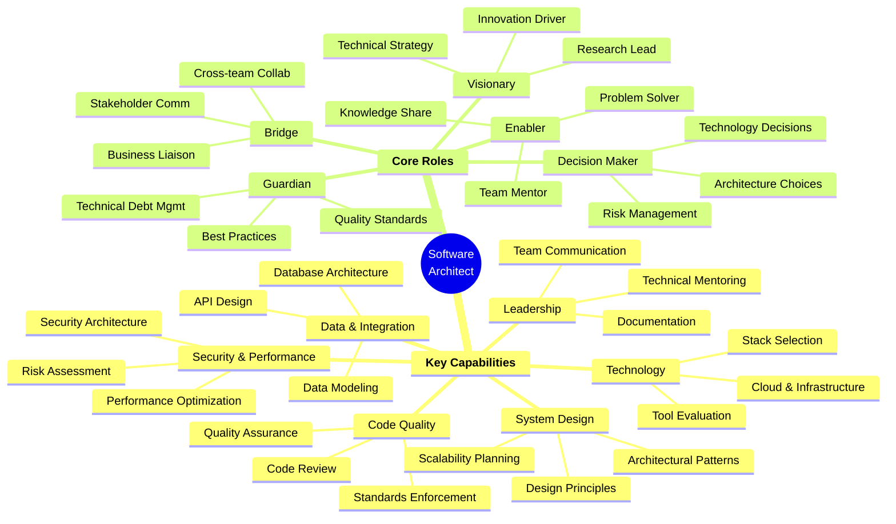
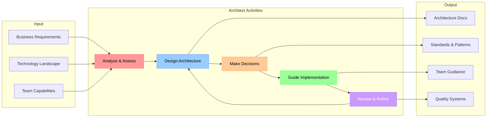

# Software Architect Capabilities and Roles

```mermaid
mindmap
  root((Software<br/>Architect))
    **Key Capabilities**
      System Design
        Architectural Patterns
        Design Principles
        Scalability Planning
      Technology
        Stack Selection
        Tool Evaluation
        Cloud & Infrastructure
      Code Quality
        Code Review
        Standards Enforcement
        Quality Assurance
      Data & Integration
        API Design
        Data Modeling
        Database Architecture
      Security & Performance
        Security Architecture
        Risk Assessment
        Performance Optimization
      Leadership
        Technical Mentoring
        Team Communication
        Documentation
    **Core Roles**
      Visionary
        Technical Strategy
        Innovation Driver
        Research Lead
      Bridge
        Business Liaison
        Stakeholder Comm
        Cross-team Collab
      Decision Maker
        Technology Decisions
        Architecture Choices
        Risk Management
      Guardian
        Quality Standards
        Technical Debt Mgmt
        Best Practices
      Enabler
        Team Mentor
        Knowledge Share
        Problem Solver
```

---

## Alternative View: Hierarchical Structure

```mermaid
graph TD
    A[Software Architect]
    
    A --> B[Capabilities]
    A --> C[Roles]
    
    B --> B1[Technical Skills]
    B --> B2[Design Skills]
    B --> B3[Leadership Skills]
    
    B1 --> B1a[System Design]
    B1 --> B1b[Cloud & Infrastructure]
    B1 --> B1c[Security Architecture]
    B1 --> B1d[Performance Optimization]
    
    B2 --> B2a[API Design]
    B2 --> B2b[Data Modeling]
    B2 --> B2c[Integration Planning]
    B2 --> B2d[Documentation]
    
    B3 --> B3a[Technical Mentoring]
    B3 --> B3b[Code Review]
    B3 --> B3c[Stakeholder Communication]
    B3 --> B3d[Team Leadership]
    
    C --> C1[Strategic Roles]
    C --> C2[Operational Roles]
    C --> C3[Collaborative Roles]
    
    C1 --> C1a[Technical Visionary]
    C1 --> C1b[Technology Decision Maker]
    C1 --> C1c[Innovation Driver]
    
    C2 --> C2a[Code Quality Guardian]
    C2 --> C2b[Performance Optimizer]
    C2 --> C2c[Technical Debt Manager]
    
    C3 --> C3a[Business-Tech Bridge]
    C3 --> C3b[Cross-team Coordinator]
    C3 --> C3c[Mentor & Coach]
    
    style A fill:#2374ab,stroke:#1a5a8a,color:#fff,stroke-width:3px
    style B fill:#4a90e2,stroke:#357abd,color:#fff
    style C fill:#50c878,stroke:#3da35d,color:#fff
    style B1 fill:#7eb3d5,stroke:#5a8fb5,color:#fff
    style B2 fill:#7eb3d5,stroke:#5a8fb5,color:#fff
    style B3 fill:#7eb3d5,stroke:#5a8fb5,color:#fff
    style C1 fill:#7ed5a8,stroke:#5eb588,color:#fff
    style C2 fill:#7ed5a8,stroke:#5eb588,color:#fff
    style C3 fill:#7ed5a8,stroke:#5eb588,color:#fff
```

---

## Workflow View: Architect in Action

```mermaid
graph LR
    subgraph Input
        REQ[Business Requirements]
        TECH[Technology Landscape]
        TEAM[Team Capabilities]
    end
    
    subgraph "Architect Activities"
        ANALYZE[Analyze & Assess]
        DESIGN[Design Architecture]
        DECIDE[Make Decisions]
        GUIDE[Guide Implementation]
        REVIEW[Review & Refine]
    end
    
    subgraph Output
        ARCH[Architecture Docs]
        STANDARDS[Standards & Patterns]
        MENTORING[Team Guidance]
        QUALITY[Quality Systems]
    end
    
    REQ --> ANALYZE
    TECH --> ANALYZE
    TEAM --> ANALYZE
    
    ANALYZE --> DESIGN
    DESIGN --> DECIDE
    DECIDE --> GUIDE
    GUIDE --> REVIEW
    REVIEW --> DESIGN
    
    DESIGN --> ARCH
    DECIDE --> STANDARDS
    GUIDE --> MENTORING
    REVIEW --> QUALITY
    
    style ANALYZE fill:#ff9999,stroke:#ff6666,color:#000
    style DESIGN fill:#99ccff,stroke:#6699ff,color:#000
    style DECIDE fill:#ffcc99,stroke:#ff9966,color:#000
    style GUIDE fill:#99ff99,stroke:#66ff66,color:#000
    style REVIEW fill:#cc99ff,stroke:#9966ff,color:#fff
```
